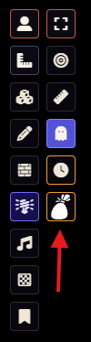
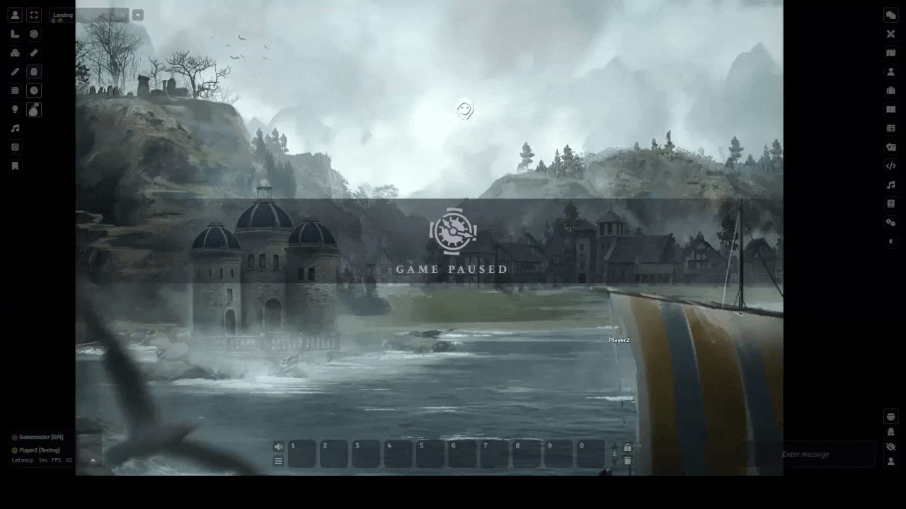
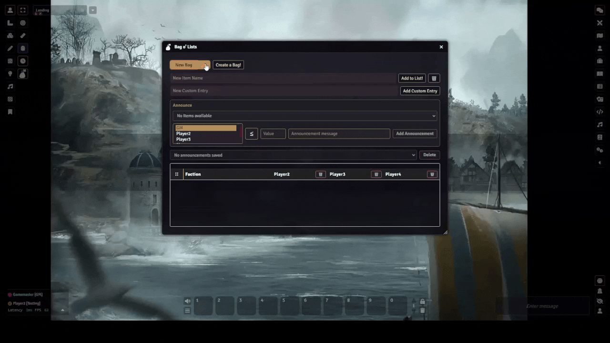
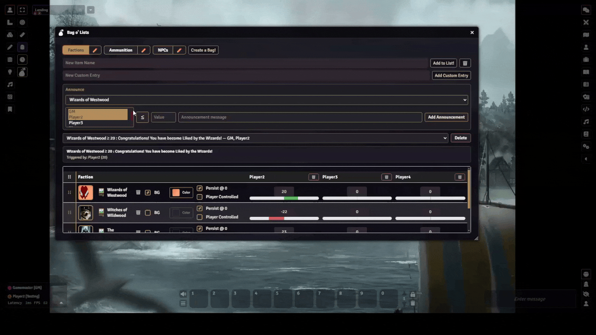

## License

This module is licensed under a [Creative Commons Attribution-NonCommercial 4.0 International License](https://creativecommons.org/licenses/by-nc/4.0/).

This work is also subject to the [Foundry Virtual Tabletop EULA - Limited License Agreement for module development](https://foundryvtt.com/article/license/).

## Description
A Foundry VTT module for tracking and sharing customizable lists such as factions, resources, reputations, or crafting supplies between the GM and players. Bag o' Lists lets you track values for each player or NPC, update everything in real time with socketlib, and use a flexible interface with custom images, backgrounds, and a portrait editor. GMs can create multiple bags (tabs), add items with unique images, choose whether items are player-controlled or GM-only, and set items to stay visible or disappear at zero. The module includes an announcement system for alerts based on item values, supports custom recipient tabs, and makes it easy to share information between player and GM. All changes are synchronized instantly for everyone, making it useful for campaign management, reputation tracking, or any game that needs interactive lists.

## About & Motivation

Hey there everyone! I am usually known as Turtle and use Foundry VTT quite a bit. It is a phenomenal platform that I love, and the way the community gets to interact and participate with it in such an open-source format is amazing. I have been running a campaign and found myself needing one of those community-based add-ons to fix my ability to present factions to my players. There were at one point modules that performed this in some format, but everything I had found was either deprecated or not functioning for me when attempting to use it. This led to the creation of Bag o' Lists. It was intended to fit my needs at first as a faction tracker, but then I came to realize that it could be so much more and fit so many more table needs. That is why it has become what it is today.

I create all my modules in my free time as a hobby and genuinely enjoy doing the development work. Everything I release is completely free because I believe in supporting this incredible community. If you find my work helpful and want to leave a tip, just know that as much as I love coffee, it will probably end up going toward student loans (I know, a tale as old as time, lol). I am also open to taking on commissions if you have an idea for a Foundry VTT module or need some help with a different type of software development or networking development. Each project is evaluated individually, so feel free to reach out if you have something in mind.

Thank you again so much for everyone creating and adding to the community, as well as supporting the amazing open-source spirit that makes the Foundry VTT community what it is!

**Support:** [ko-fi.com/lunatheturtle](https://ko-fi.com/lunatheturtle)

## Usage Instructions

1. **Install & Enable:**
	- Download and install Bag o' Lists from the Foundry VTT module browser or manually add it to your modules folder.
	- Enable the module in your world settings.

2. **Open the Tracker:**
	- Click the bag icon in the left Scene Controls toolbar to open or close the Bag o' Lists tracker.

3. **GM Controls:**
	- Create new bags (pages) with the "Create a Bag!" button.
	- Add items (factions/resources) to each bag.
	- Rename or delete bags as needed.
	- For each item, toggle:
	  - **Persist @ 0:** If checked, item remains visible to players at zero value.
	  - **Player Controlled:** If checked, players can adjust the value themselves.
	- Add **Custom Entries** to track NPCs or groups alongside players; a Share toggle promotes them to a dedicated player-facing tab.
	- Queue **Announcements** beneath the custom entry panel to track item thresholds (≤/≥), choose one or more recipients (players and/or GM), save the reminder, and reuse or delete it from a compact dropdown.

4. **Player Controls:**
	- Players see only the bags and items relevant to them.
	- If "Player Controlled" is enabled for an item, players can use up/down arrows to adjust its value.
	- When the GM shares a custom entry, players gain a dedicated tab with page subtabs that aggregate that entry's values across every shared bag.

5. **Real-Time Sync:**
	- All changes are synced instantly to all users via socketlib.

## Features

- Track multiple customizable lists ("bags") for factions, resources, ammunition, crafting, or anything your table needs.
- Per-page data: each bag is its own tab with separate items and values.
- GM and player views: GMs see all data and controls, players see only their relevant info.
- Items can disappear at zero or persist, based on GM setting (great for tracking expendable or craftable resources).
- Player-controlled items: allow players to adjust values directly.
- Custom recipients: create NPCs, factions, or friendlies as "players" the GM can update, then broadcast their standing to real players through shared tabs with per-page subtabs.
- Announcement triggers: store per-page reminders that watch any item in the tracker, target specific players/the GM, and surface the alert automatically to everyone selected once the value crosses the ≤/≥ threshold.
- WYSIWYG portrait editor: zoom and reposition images inside a live 1:1 preview so the table portrait always matches what you see in the editor.
- Real-time updates for all users using socketlib.

## Support
For questions, feature requests or bug reports, please open an issue [here](https://github.com/Luna-the-Turtle/Bag-o-Lists/issues).

---

## Module Showcase
A full module showcase can be seen at this youtube link: https://youtu.be/nGGm2M9jqu8

---

## Screenshots & Usage Examples

### 1. Opening the Tracker
You can see the button has been added to the scene controls on the left. It will look like this.

Here you can see the tracker being opened.

---

### 2. Creating & Managing Lists
**Make New Bags:**
Create new pages ("bags") for different lists or trackers. The following shows the process of making new bags.

**Adding Items:**
Add new items to any bag. Items can represent factions, resources, or anything you want to track.

**Renaming Bags:**
Rename any bag directly from the UI for better organization.

**Deleting Tabs:**
Remove a bag or a player's tab as needed. This first delete shown will remove it everywhere for all players as well as the GM. The second delete shown will remove it for that player only.

---

### 3. Customizing Items & Player Controls
**Adding Images:**
Choose custom images for your items. Use the portrait editor to zoom, reposition, and crop images for a perfect fit.

**Backgrounds & Repositioning:**
Adjust item backgrounds and reposition images for clarity and style. The backgrounds are made to work well with .png format.

Players can adjust them as well!

**Set Values for Players:**
GMs can set values for each player or custom entry.

**New Custom Player:**
Add custom recipients (NPCs, groups, etc.) to track alongside players. 

**Share Custom Entry:**
GMs can share these custom entries with players, making them visible as dedicated tabs.

**Players Can View Shared Entries:**
Players can select the shared custom entry to see it's tracked values with existing bags. 

This functionality allows the GM to create a cross-matrix of custom entries with existing bags so that the player can as in my example see the relationship that an NPC has with in world factions.
---

### 4. Announcements & Alerts
**Announcement System:**
Set up announcements to alert players or the GM when item values cross a threshold. Announcements are dismissible and will reappear if the condition is met again. 

This allows the GM to set up permanent messages to appear for when a Reputation level threshold is obtained or when a Consumable runs low.

**Reoccurring Announcements:**
See how announcements can be triggered multiple times as values change.

This allows a player that crafts their own consumables to have the announcement stay even when the item is used up and then resupplied.

---

### 5. Item Tracking Features
**Player Tracked Values:**
Players can adjust item values using their arrows. This works with the persist on 0 state, allowing a player to manually track and resupply the item if it is recovered through crafting or rest.

**Persist on Zero:**
Shows an item disappearing when reaching 0, then the checkbox being marked so it persists at zero. This allows an item to remain if fully consumed, so a player that crafts the item regularly can still see the item or category.

**Real-Time Updates:**
All changes are synced instantly to all users via socketlib.

---

## Dependency

**Bag o' Lists requires the [socketlib](https://github.com/manuelVo/socketlib) module to be installed and enabled for real-time syncing.**

---

## Asset Credits

This module uses the backpack icon from the PF2e system for Foundry VTT, created and maintained by the PF2e System Developers:
- PF2e System: https://github.com/foundryvtt/pf2e
- License: Paizo Community Use Policy (https://paizo.com/community/communityuse)
- Icon: styles/backpack.svg

All images used for Bag o' Lists usage examples (screenshots and gifs) were obtained from [Pixabay](https://pixabay.com/) as free-use images with no royalty requirements. A full list of image sources is documented in `images/Attribution.md` in this repository.

### Example Image Categories & Sources

**Factions**
- https://pixabay.com/photos/witchcraft-the-wizard-magic-4893559/
- https://pixabay.com/vectors/robe-cape-clothing-gown-155409/
- https://pixabay.com/illustrations/ai-generated-dragon-black-dragon-9219458/
- https://pixabay.com/illustrations/golem-stone-rock-statue-giant-8738112/

**Ammunition**
- https://pixabay.com/vectors/arc-archery-arco-arrow-quiver-2026927/
- https://pixabay.com/vectors/bomb-grenade-explosion-weapon-4757693/
- https://pixabay.com/vectors/poison-toxic-bottle-liquid-green-146494/

**NPCs**
- https://pixabay.com/vectors/woman-girl-amazon-aim-archer-156849/
- https://pixabay.com/vectors/vampire-vampiric-witch-gothic-5431457/
- https://pixabay.com/vectors/person-fantasy-magic-mask-157130/

For full attribution and direct links, see `images/Attribution.md`.

"Bag o' Lists" is not published, endorsed, or specifically approved by Paizo. For more information about Paizo Inc. and Paizo products, visit https://paizo.com.