# Bag o' Lists – *Track, Share, and Sync Custom Lists in Foundry VTT*

## License

This module is licensed under a [Creative Commons Attribution-NonCommercial 4.0 International License](https://creativecommons.org/licenses/by-nc/4.0/).

This work is also subject to the [Foundry Virtual Tabletop EULA - Limited License Agreement for module development](https://foundryvtt.com/article/license/).

## Description
**Bag o' Lists** is a versatile module for Foundry VTT that lets GMs and players create, share, and manage multiple customizable lists—perfect for tracking factions, resources, crafting materials, ammunition, and more. With real-time updates powered by socketlib, every change is instantly synced across all users.

## About & Motivation

Hey there everyone! I am usually known as Turtle and use Foundry VTT quite a bit. It is a phenomenal platform that I love, and the way the community gets to interact and participate with it in such an open-source format is amazing. I have been running a campaign and found myself needing one of those community-based add-ons to fix my ability to present factions to my players. There were at one point modules that performed this in some format, but everything I had found was either deprecated or not functioning for me when attempting to use it. This led to the creation of Bag o' Lists. It was intended to fit my needs at first as a faction tracker, but then I came to realize that it could be so much more and fit so many more table needs. That is why it has become what it is today.

I create all my modules in my free time as a hobby and genuinely enjoy doing the development work. Everything I release is completely free because I believe in supporting this incredible community. If you find my work helpful and want to leave a tip, just know that as much as I love coffee, it will probably end up going toward student loans (I know, a tale as old as time, lol). I am also open to taking on commissions if you have an idea for a Foundry VTT module or need some help with a different type of software development or networking development. Each project is evaluated individually, so feel free to reach out if you have something in mind.

Thank you again so much for everyone creating and adding to the community, as well as supporting the amazing open-source spirit that makes the Foundry VTT community what it is!

**Support:** [ko-fi.com/lunatheturtle](https://ko-fi.com/lunatheturtle)

## How It Works

1. **Install & Enable:**
	- Download and install Bag o' Lists from the Foundry VTT module browser or manually add it to your modules folder.
	- Enable the module in your world settings.

2. **Open the Tracker:**
	- Click the bag icon in the left Scene Controls toolbar to open or close the Bag o' Lists tracker.

3. **GM Controls:**
	- Create new bags (pages) with the "Create a Bag!" button.
	- Add items (factions/resources) to each bag.
	- Rename or delete bags as needed.
	- For each item, toggle:
	  - **Persist @ 0:** If checked, item remains visible to players at zero value.
	  - **Player Controlled:** If checked, players can adjust the value themselves.
	- Add **Custom Entries** to track NPCs or groups alongside players; a Share toggle promotes them to a dedicated player-facing tab.
	- Queue **Announcements** beneath the custom entry panel to track item thresholds (≤/≥), choose one or more recipients (players and/or GM), save the reminder, and reuse or delete it from a compact dropdown.

4. **Player Controls:**
	- Players see only the bags and items relevant to them.
	- If "Player Controlled" is enabled for an item, players can use up/down arrows to adjust its value.
	- When the GM shares a custom entry, players gain a dedicated tab with page subtabs that aggregate that entry's values across every shared bag.

5. **Real-Time Sync:**
	- All changes are synced instantly to all users via socketlib.

## Features

- **Create and manage multiple "bags" (tabs)** for any purpose, such as factions, resources, NPCs, and more.
- **Add custom images** to items with a built-in portrait editor for zoom and repositioning.
- **GM and player views:** GMs see and control all data, players see only their relevant lists.
- **Items can disappear at zero or persist,** based on GM settings.
- **Player-controlled items:** let players adjust values directly with arrows or typed input.
- **Real-time updates** for all users using socketlib.
- **Dedicated edit dialogs** for items and characters with UUID linking to access the items from the UI.
- **Announcement system** with chat integration, custom thresholds, and player targeting.
- **Archive system** for storing, exporting, and importing entries. This allows what NPCs or Factions are used to be modular and storable.
- **12 configurable settings** for accessibility, display, and workflow preferences.
- **Player notification management** with permanent dismissals that can be re-enabled.

## Support
For questions, feature requests or bug reports, please open an issue [here](https://github.com/Luna-the-Turtle/Bag-o-Lists/issues).

---

## Module Showcase
A full module showcase can be seen at this youtube link: https://youtu.be/nGGm2M9jqu8  

***This video is for the last version release of the module and is not up to date. It will be updated at a later time.***

---

## Screenshots & Usage Examples

### 1. Opening the Tracker
Click the bag icon in the left Scene Controls toolbar to open or close the Bag o' Lists tracker.

**The Scene Controls Button:** You can see the button has been added to the scene controls on the left.

**Opening the Tracker:** Here you can see the tracker being opened and closed.

---

### 2. GM & Player Views
GMs can see and manage all lists, add items, and customize images. Players see only their relevant lists and items.

**GM View:** The GM can see all data, controls, and items across every bag.

**Player View:** Players see only the bags and items relevant to them.

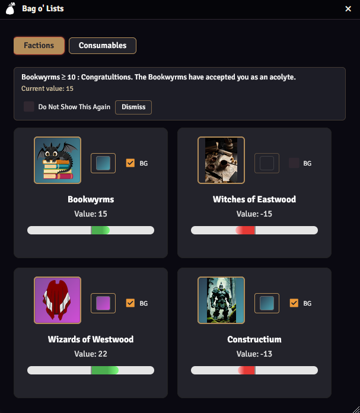

**Resizable Window:** Change the window size so that it is viewed the way you want.

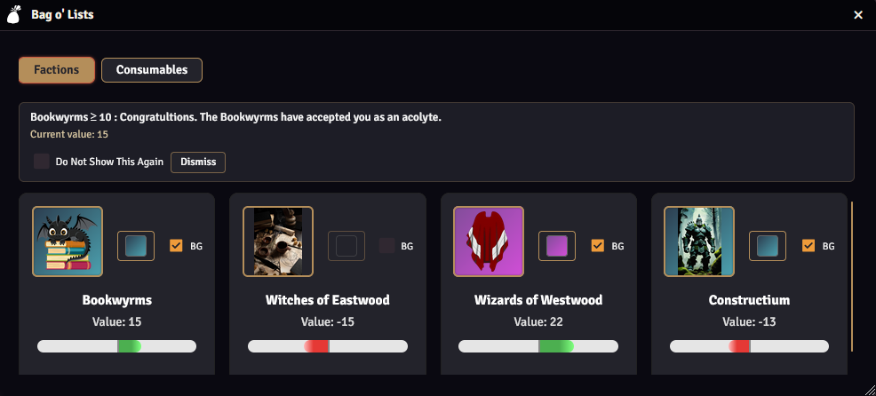

---

### 3. Creating & Managing Lists
Create new bags and items, rename or delete tabs, and customize each list for your table's needs.

**Create a New Bag & Add Items:** Create new pages ("bags") for different lists or trackers, and add new items to any bag. Items can represent factions, resources, or anything you want to track.

**Delete Tabs:** Remove a bag or a player's tab as needed. The delete action shown removes it for all players and the GM. The delete under the player name in the column will delete it for that player only.

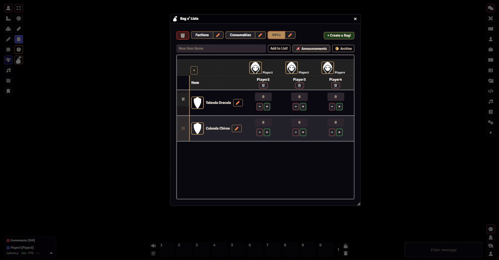

---

### 4. Character Icons & Column Alignment
The GM view displays character portraits above the table, perfectly aligned with their corresponding data columns. Click any portrait to edit the character, or use the **+** button to add new characters or custom entries.

**Character Portraits Above Columns:** Portraits align with their data columns and are interactive.

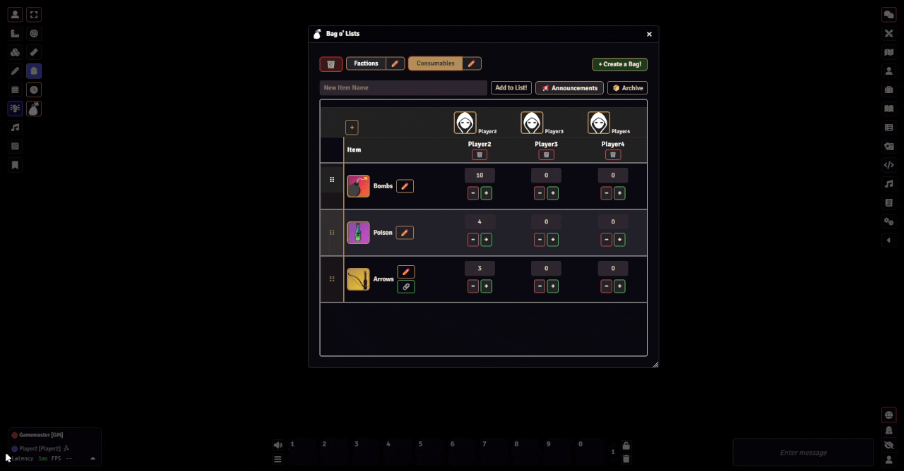

---

### 5. Edit Item Dialog
Click the ✏️ button on any item to open the **Edit Item Dialog**. From here you can configure:
- **Name & Description** — add a description that shows as a tooltip and preview in the table.
- **Linked Item (UUID)** — link to any Foundry document; drag items from the sidebar or paste a UUID. Linked names become clickable to open the document.
- **Custom Icon** — pick an image and adjust framing with the built-in portrait editor.
- **Background Color** — toggle a background and choose from gradient or solid color presets.
- **Persist @ 0** — keep the item visible to players even at zero value.
- **Player Controlled** — allow players to adjust the value themselves.
- **Custom Value Range** — set a custom min/max range (e.g., 0–100 for resources, -50 to +50 for reputation).
- **Delete** — permanently remove the item from the bag.

**The Edit Item Dialog:**

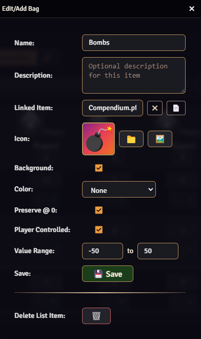

---

### 6. Edit Character Dialog
Click any character portrait or the ✏️ icon to open the **Edit Character Dialog**.
***Note: These are already ported from the player character sheets, so it is mainly for custom entries that are added by the GM.***
Configure:
- **Name** — set or change the display name.
- **Icon** — choose a custom image and adjust framing.
- **Show Icon** — toggle whether the character icon displays in the header row.
- **Background Color** — enable and select a background color for the portrait.
- **Delete** — remove custom characters (player characters can be removed via the table header).

**The Edit Character Dialog:**

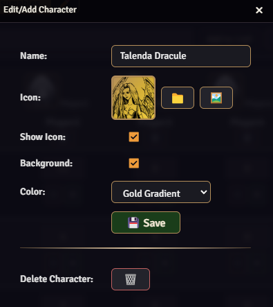

---

### 7. Customizing Items
Choose your own images for item portraits using the built-in portrait editor. Zoom, reposition, and crop images for a perfect fit. Select from gradient and solid background colors for visual flair.

**Choose an Image, Background, and Reposition:** Select an image, pick a background color, and reposition to get the look you want.

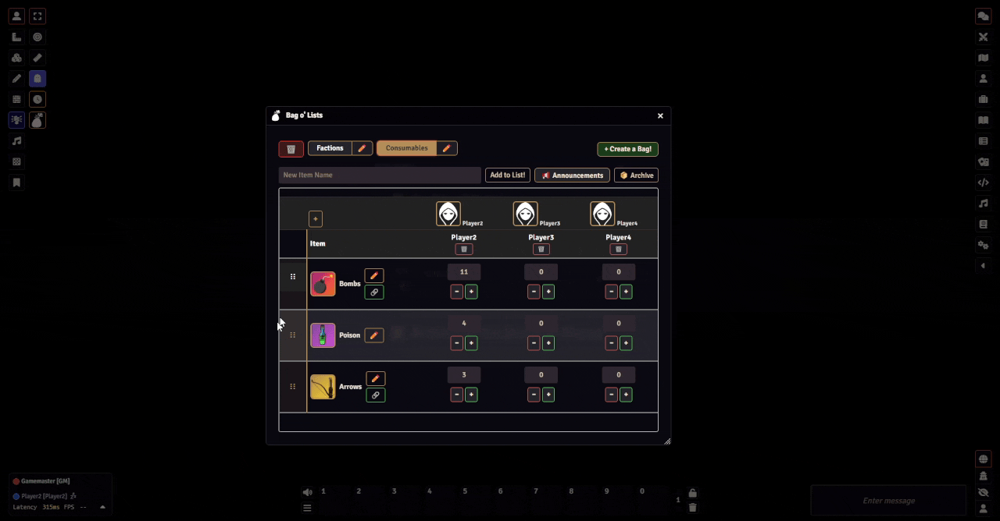

**Players Can Adjust Backgrounds Too:** Players can adjust backgrounds on their own cards as well!

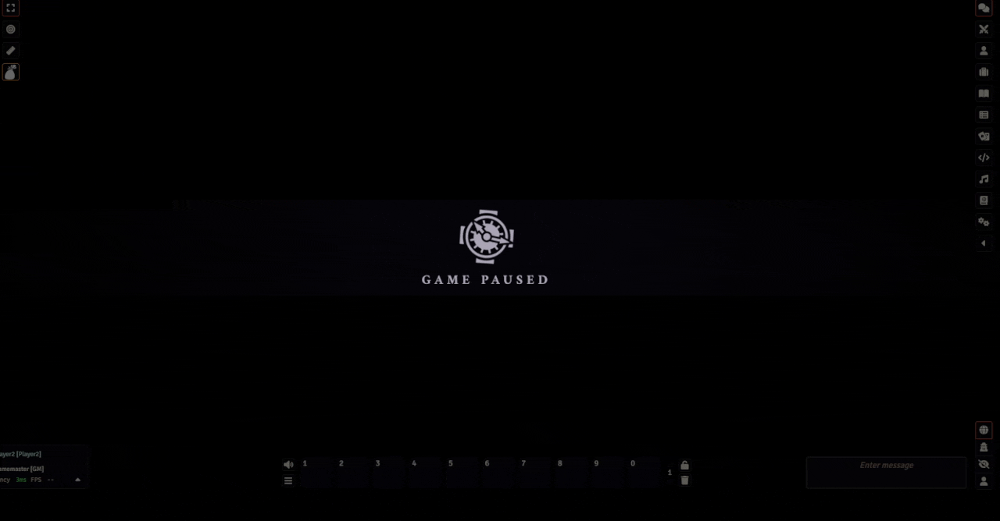

---

### 8. GM Value Controls
GMs can set values for each player using the number input, or quickly adjust with the **+** and **−** buttons directly in each table cell. Values respect the item's custom min/max range.

**Setting Values for Players:**

---

### 9. Item Descriptions & UUID Linking
Add descriptions to items that display as a tooltip preview in both GM and player views. Link items to any Foundry document via UUID—item names become clickable links that open the linked document's sheet. Drag and drop items from the Foundry sidebar directly into the UUID field.

**Linking Items via UUID:** Drag and drop or paste a UUID to link any Foundry document. Linked names become clickable.

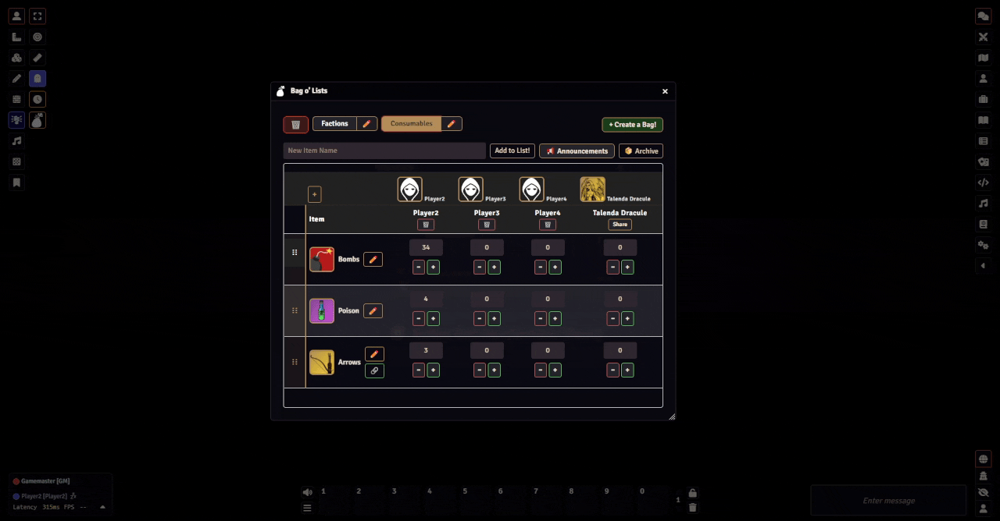

---

### 10. Custom Characters & Shared Entries
Add custom recipients (NPCs, groups, etc.) to track alongside players using the **+** button in the character icons row. Share custom entries with players using the **Share** button—shared entries appear as dedicated player tabs with per-page subtabs.

**Creating and Sharing a Custom Entry:** Add a custom NPC or group, then share it so players can see its values across all bags.

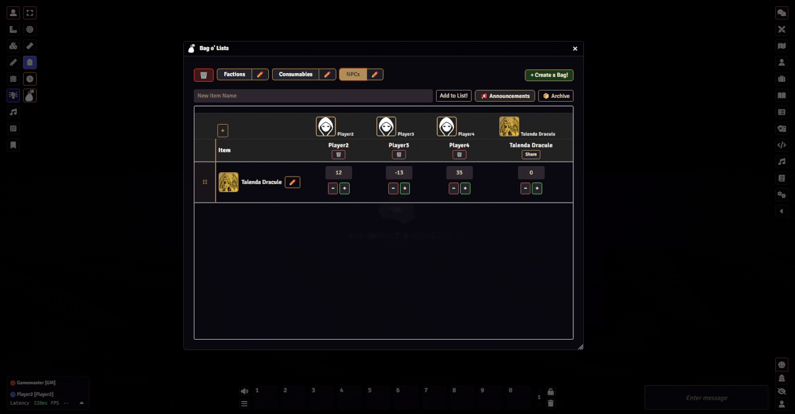

Players can view shared entries across all bags!

**In this example shown, it means the Player can see the Faction Reputation that the NPC has with the same in-world Factions that the Player has Reputation with.**

---

### 11. Announcements & Alerts
Access the announcement system through the **📢 Announcements** button (with a live alert badge showing active alert count). The dedicated Announcements Dialog lets you:

- **Create announcements** targeting specific items with ≤/≥ threshold conditions.
- **Target recipients** — select individual players, "Any Player" (first to trigger), or "All Players."
- **Custom messages** for each announcement.
- **Send to Chat** — optionally post triggered announcements to the Foundry chat, with selectable chat recipients (GM Only, Everyone, or specific players) and an "Include Details" toggle.
- **Manage saved announcements** — edit, duplicate, delete, or duplicate to a different item.

**The Announcements Dialog:** Set up announcements with item thresholds, target recipients, and custom messages.

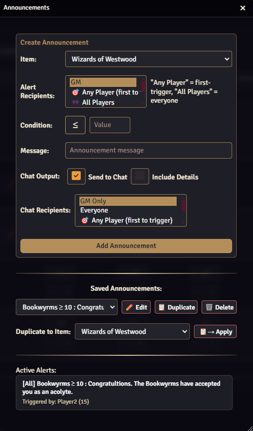

**Announcements Sent to Chat:** Triggered announcements can be posted to Foundry's chat log for all selected recipients to see.

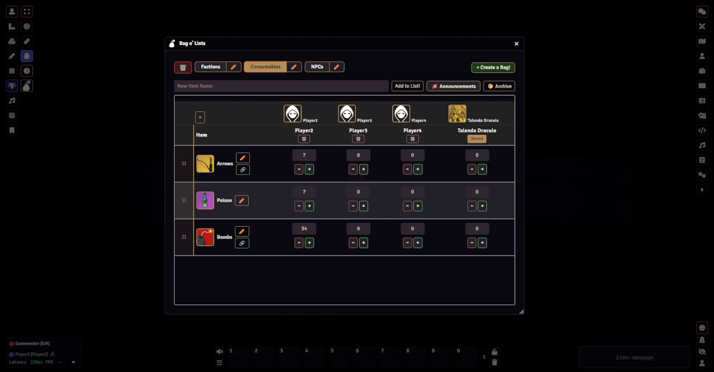

**Reoccurring Announcements:** Announcements are dismissible and will reappear if the condition is met again.

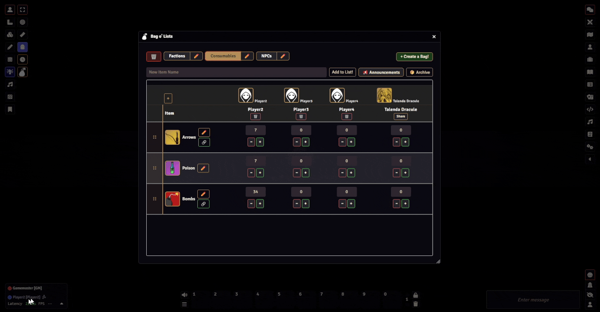

This way you can have the announcement as a focus for either the Bag o' Lists UI or using Foundry's Chat Log!

---

### 12. Player Notification Management
Players can manage their announcement notifications with three levels of control:

- **Dismiss** — temporarily hide an alert for the current session.
- **"Do Not Show This Again"** — permanently dismiss a specific notification while still receiving chat messages.
- **Re-enable** — bring back previously dismissed notifications from the collapsible "Disabled Notifications" panel.

***Note: If a dismissed notification is re-enabled, then the GM or Player will need to increment/decrement the value above/below the conditional to have the notification apply again. I tried multiple times to work around this issue, but it was more tricky than the time warranted.***

**Managing Player Notifications:** Dismiss, permanently disable, or re-enable notifications.

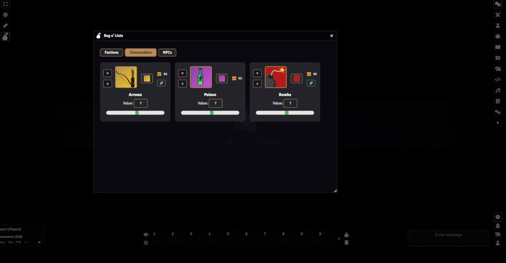

---

### 13. Archive System
Access the archive through the **📦 Archive** button. The Archive Dialog lets you:

- **Archive entries** — move items to storage to keep your active list clean.
- **Restore entries** — bring archived items back to the active list.
- **Export archive** — save your archive to a JSON file for backup or sharing.
- **Import archive** — load archived entries from a JSON file.
- **Permanently delete** — remove archived entries when no longer needed.

**Archive and Restore:** Archive items to storage and bring them back as needed.

**Export and Import:** Save your current archive state as a JSON export and import it back when needed.

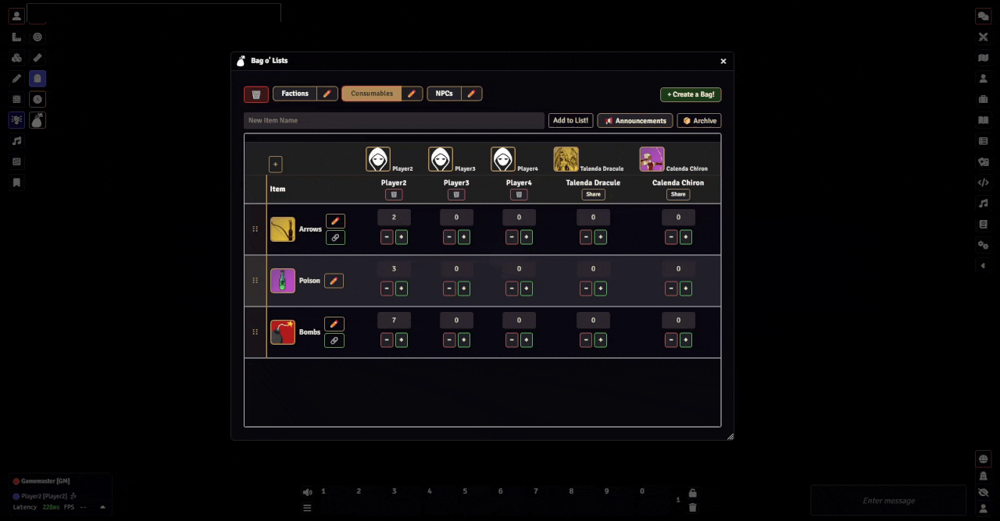

---

### 14. Item Tracking Features
**Player-Controlled Values:**
Players can adjust item values using up/down arrows or type values directly into the input field. This works with persist-on-zero, allowing a player to manually track and resupply items through crafting or rest.

**Persist on Zero:**
Items with "Persist @ 0" remain visible to players even at zero value—perfect for craftable or resupplied consumables. Items without it disappear when reaching zero, great for unique or finite resources.

**Drag-and-Drop Reordering:**
Reorder items in the GM view by dragging the ⋮⋮ handle on any row.

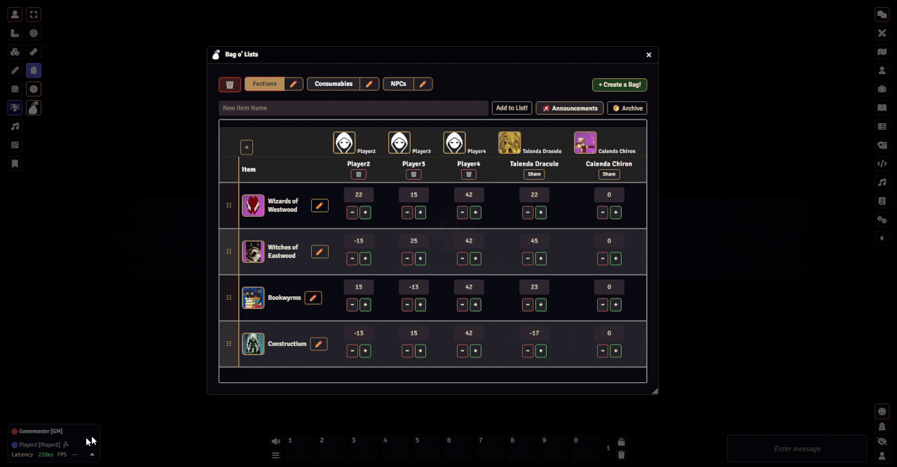

---

### 15. Settings & Accessibility
Bag o' Lists includes 12 configurable settings accessible from Foundry's Module Settings:

**Confirmation Settings:**
- Confirm before deleting pages/bags
- Confirm before deleting items
- Confirm before importing archives

**Default Settings:**
- Default minimum and maximum value range for new items
- Default item image (with file picker)
- Show archive reminder when deleting items

**Display Settings:**
- **Compact Mode** — reduces spacing and font sizes to fit more content
- **Large Fonts** — increases font sizes for readability
- **Show Player Names** — toggle character names above portraits and in table headers
- **Show Tooltips** — enable/disable helpful hover tooltips on all controls

**Accessibility Settings:**
- **High Contrast Mode** — bolder borders and higher contrast colors for improved visibility

**Configuring Module Settings:** All settings are accessible from Foundry's Module Settings panel.

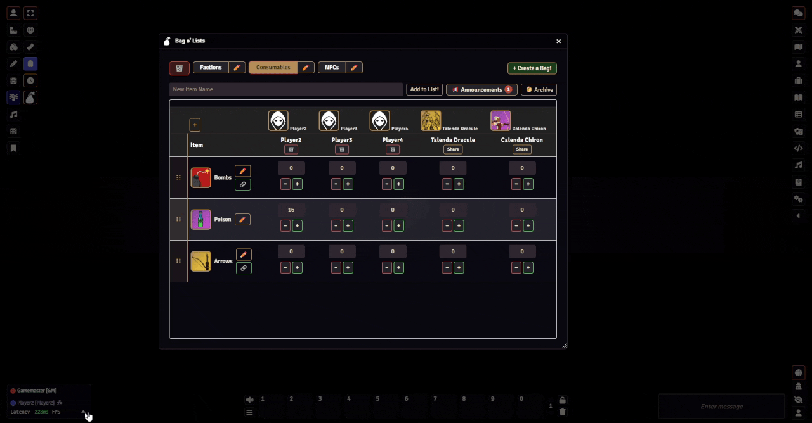

---

### 16. Real-Time Sync
All changes are synced instantly to all users via socketlib—including value changes, announcement triggers, notification dismissals, and archive operations. This can be seen in many of the prior example videos.

---

## Dependency

**Bag o' Lists requires the [socketlib](https://github.com/manuelVo/socketlib) module to be installed and enabled for real-time syncing.**

---

## Asset Credits

This module uses the backpack icon from the PF2e system for Foundry VTT, created and maintained by the PF2e System Developers:
- PF2e System: https://github.com/foundryvtt/pf2e
- License: Paizo Community Use Policy (https://paizo.com/community/communityuse)
- Icon: styles/backpack.svg

"Bag o' Lists" is not published, endorsed, or specifically approved by Paizo. For more information about Paizo Inc. and Paizo products, visit https://paizo.com.

All images used for Bag o' Lists usage examples (screenshots and gifs) were obtained from [Pixabay](https://pixabay.com/) as free-use images with no royalty requirements. A full list of image sources is documented in `images/Attribution.md` in this repository.

### Example Image Categories & Sources

**Factions**
- https://pixabay.com/photos/witchcraft-the-wizard-magic-4893559/
- https://pixabay.com/vectors/robe-cape-clothing-gown-155409/
- https://pixabay.com/illustrations/ai-generated-dragon-black-dragon-9219458/
- https://pixabay.com/illustrations/golem-stone-rock-statue-giant-8738112/

**Ammunition**
- https://pixabay.com/vectors/arc-archery-arco-arrow-quiver-2026927/
- https://pixabay.com/vectors/bomb-grenade-explosion-weapon-4757693/
- https://pixabay.com/vectors/poison-toxic-bottle-liquid-green-146494/

**NPCs**
- https://pixabay.com/vectors/woman-girl-amazon-aim-archer-156849/
- https://pixabay.com/vectors/vampire-vampiric-witch-gothic-5431457/
- https://pixabay.com/vectors/person-fantasy-magic-mask-157130/

For full attribution and direct links, see `images/Attribution.md`.

---

## User Contributor Credits

The following users provided feedback, suggestions, or issue reports that directly led to improvements and new features in Bag o' Lists. Thank you for helping make this module better for everyone!

**DeviousHearts**  
Professional UX designer who provided detailed mock-ups, interface suggestions, and a comprehensive review of the module's user experience. Their feedback led to improvements in the UI, dialog layouts, and overall usability.  

**naaggynerd**  
Suggested customizable min/max value ranges, positive-only tracking, and requested a character sheet tab for easier access. Their ideas inspired new configuration options and added features. 

**noblue123**  
Provided extensive suggestions for faction tracker use cases, including enhanced announcement functionality, item descriptions, improved input controls, archive management, and UI scalability. Many of these ideas have been incorporated into recent updates.

If you have suggestions or find issues, please open an issue on GitHub—your feedback is always welcome and appreciated!

---

