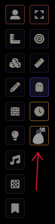
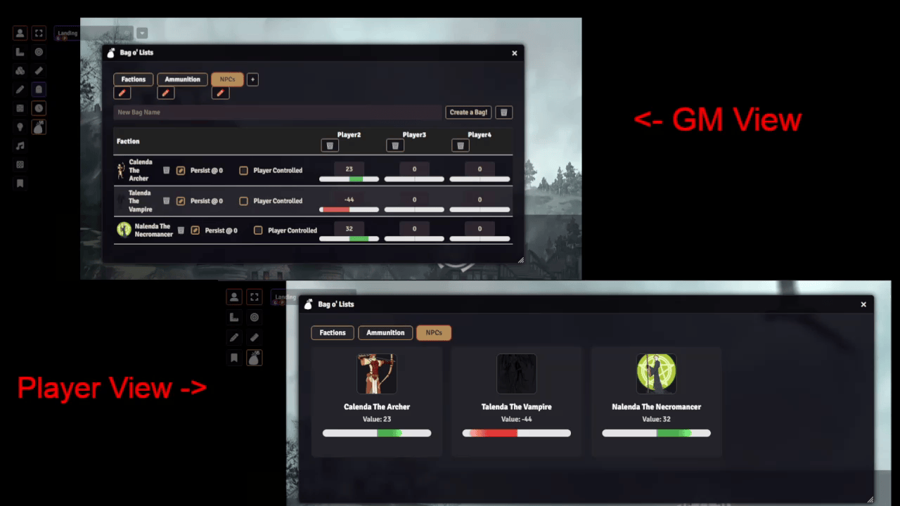
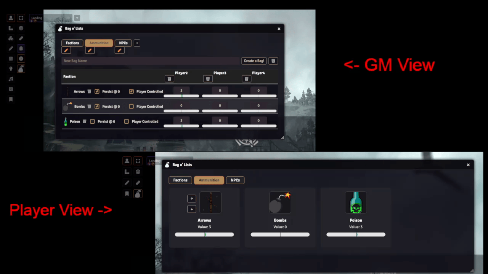
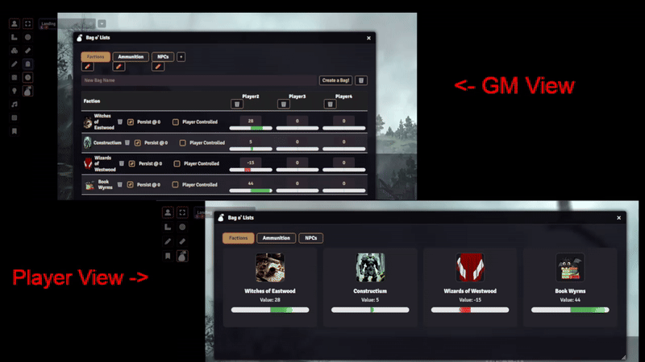

## License

This module is licensed under a [Creative Commons Attribution-NonCommercial 4.0 International License](https://creativecommons.org/licenses/by-nc/4.0/).

This work is also subject to the [Foundry Virtual Tabletop EULA - Limited License Agreement for module development](https://foundryvtt.com/article/license/).

## Description
A Foundry VTT module that allows the user to create sharable lists between the GM and Player. Custom images can be used for Item Portraits and using socketLib has real-time updating.

## About & Motivation

Hey there everyone! I am usually known as Turtle and use Foundry VTT quite a bit. It is a phenomenal platform that I love, and the way the community gets to interact and participate with it in such an open-source format is amazing. I have been running a campaign and found myself needing one of those community-based add-ons to fix my ability to present factions to my players. There were at one point modules that performed this in some format, but everything I had found was either deprecated or not functioning for me when attempting to use it. This led to the creation of Bag o' Lists. It was intended to fit my needs at first as a faction tracker, but then I came to realize that it could be so much more and fit so many more table needs. That is why it has become what it is today.

I create all my modules in my free time as a hobby and genuinely enjoy doing the development work. Everything I release is completely free because I believe in supporting this incredible community. If you find my work helpful and want to leave a tip, just know that as much as I love coffee, it will probably end up going toward student loans (I know, a tale as old as time, lol). I am also open to taking on commissions if you have an idea for a Foundry VTT module or need some help with a different type of software development or networking development. Each project is evaluated individually, so feel free to reach out if you have something in mind.

Thank you again so much for everyone creating and adding to the community, as well as supporting the amazing open-source spirit that makes the Foundry VTT community what it is!

**Support:** [ko-fi.com/lunatheturtle](https://ko-fi.com/lunatheturtle)

## Usage Instructions

1. **Install & Enable:**
	- Download and install Bag o' Lists from the Foundry VTT module browser or manually add it to your modules folder.
	- Enable the module in your world settings.

2. **Open the Tracker:**
	- Click the bag icon in the left Scene Controls toolbar to open or close the Bag o' Lists tracker.

3. **GM Controls:**
	- Create new bags (pages) with the "Create a Bag!" button.
	- Add items (factions/resources) to each bag.
	- Rename or delete bags as needed.
	- For each item, toggle:
	  - **Persist @ 0:** If checked, item remains visible to players at zero value.
	  - **Player Controlled:** If checked, players can adjust the value themselves.

4. **Player Controls:**
	- Players see only the bags and items relevant to them.
	- If "Player Controlled" is enabled for an item, players can use up/down arrows to adjust its value.

5. **Real-Time Sync:**
	- All changes are synced instantly to all users via socketlib.

## Features

- Track multiple customizable lists ("bags") for factions, resources, ammunition, crafting, or anything your table needs.
- Per-page data: each bag is its own tab with separate items and values.
- GM and player views: GMs see all data and controls, players see only their relevant info.
- Items can disappear at zero or persist, based on GM setting (great for tracking expendable or craftable resources).
- Player-controlled items: allow players to adjust values directly.
- Real-time updates for all users using socketlib.

## Support
For questions, feature requests or bug reports, please open an issue [here](https://github.com/Luna-the-Turtle/Bag-o-Lists/issues).

---

## Screenshots & Usage Examples

### 1. Opening the Tracker
You can see the button has been added to the scene controls on the left. It will look like this.

Here you can see the tracker being opened on the GM side as well as the Player side.

---

### 2. GM & Player Views
**GM View:**
The GM can see and manage all lists, add items, and set custom images. This is a view of the Tracker from the GM perspective.

**Player View:**
Players see only their relevant lists and items. This is a view of the Tracker from the Player perspective.

---

### 3. Creating & Managing Lists
**Add Tab & Item:**
Here you can see how new pages/tabs can be created as well as the items for the list to be seen by the player.
All items are tracker by player so what is shown for one player is not visible for another unless they have a value for that item.

**Rename & Delete Tabs:**
You can even remove the page entirely from the player's view by hitting the delete icon to remove the page. This will remove it for that player only. You also can delete entire tabs and that will remove it everywhere.

---

### 4. Customizing Items
**Choosing Images:**
You can choose your own images to have show up. A warning that it will have black background so images that are dark will not show up as well. This is something I plan on updating later as well as the ability to center the image as you would like. For now you can pretty easily choose images that work well with the setup or add a background to the image/png.

---

### 5. Item Tracking Features
**Persist on Zero:**
Shows an item disappearing when reaching 0, then the checkbox being marked so it persists at zero. This allows an item to remain if fully consumed. That way a player that crafts the item regularly can still see the item or category. 

**Player Tracked Values:**
Shows the player adjusting item values using their arrows. This works hand in hand with the persist on 0 state as it allows a player to manually track an item and resupply the item if it is recovered through crafting or rest.

**Real-Time Updates:**
Everything updates in real-time everywhere. This is so the player can see the changes immediately and doesn't have to close and re-open the tracker to see updates.

---

## Dependency

**Bag o' Lists requires the [socketlib](https://github.com/manuelVo/socketlib) module to be installed and enabled for real-time syncing.**

---

## Asset Credits

This module uses the backpack icon from the PF2e system for Foundry VTT, created and maintained by the PF2e System Developers:
- PF2e System: https://github.com/foundryvtt/pf2e
- License: Paizo Community Use Policy (https://paizo.com/community/communityuse)
- Icon: styles/backpack.svg

All images used for Bag o' Lists usage examples (screenshots and gifs) were obtained from [Pixabay](https://pixabay.com/) as free-use images with no royalty requirements. A full list of image sources is documented in `images/Attribution.md` in this repository.

### Example Image Categories & Sources

**Factions**
- https://pixabay.com/photos/witchcraft-the-wizard-magic-4893559/
- https://pixabay.com/vectors/robe-cape-clothing-gown-155409/
- https://pixabay.com/illustrations/ai-generated-dragon-black-dragon-9219458/
- https://pixabay.com/illustrations/golem-stone-rock-statue-giant-8738112/

**Ammunition**
- https://pixabay.com/vectors/arc-archery-arco-arrow-quiver-2026927/
- https://pixabay.com/vectors/bomb-grenade-explosion-weapon-4757693/
- https://pixabay.com/vectors/poison-toxic-bottle-liquid-green-146494/

**NPCs**
- https://pixabay.com/vectors/woman-girl-amazon-aim-archer-156849/
- https://pixabay.com/vectors/vampire-vampiric-witch-gothic-5431457/
- https://pixabay.com/vectors/person-fantasy-magic-mask-157130/

For full attribution and direct links, see `images/Attribution.md`.

"Bag o' Lists" is not published, endorsed, or specifically approved by Paizo. For more information about Paizo Inc. and Paizo products, visit https://paizo.com.